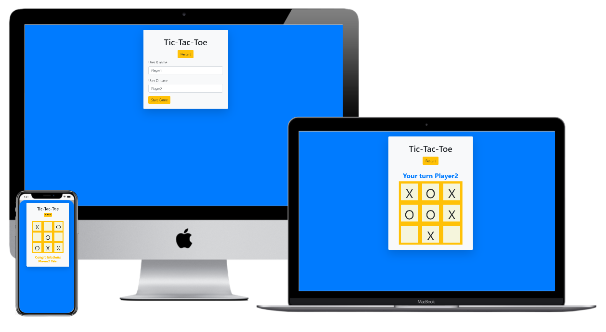

# Javascript Tic-Tac-Toe Project

A Tic Tac Toe game you can play in your browser!



# Live Demo

[Live demo](https://salvador-on.github.io/Tic-Tac-Toe-JS/.)

# What it does

- The users can log their name and start playing
- The game has the winning logic so it will stop when someone wins or if it's a tie.

## Author

**Salvador Olvera**
- Linkedin: [Salvador Olvera](https://www.linkedin.com/in/salvador-olvera-n)
- Github: [@Salvador-ON](https://github.com/Salvador-ON)
- Twitter: [@Salvador Olvera_ON](https://twitter.com/Salvador_ON) 

**Mohamed Naser**
- Linkedin: [Mohamed Naser](https://www.linkedin.com/in/mohamed-naser-amein/)

## Setup

Open your git bash and cd to the location you'd like to put your files the run the command below.

```console
git clone https://github.com/Salvador-ON/Tic-Tac-Toe-JS.git
```
Install Dependances
```console
npm install
```
Run Unit Testing 
```console
npm test
```
Make Wepback Watch the project files 
```console
npx webpack --watch
```

## Contributing

This is a project for educational purposes only. We are not accepting contributions.

## Show your support

Give a ⭐️ if you like this project!

## Enjoy!
